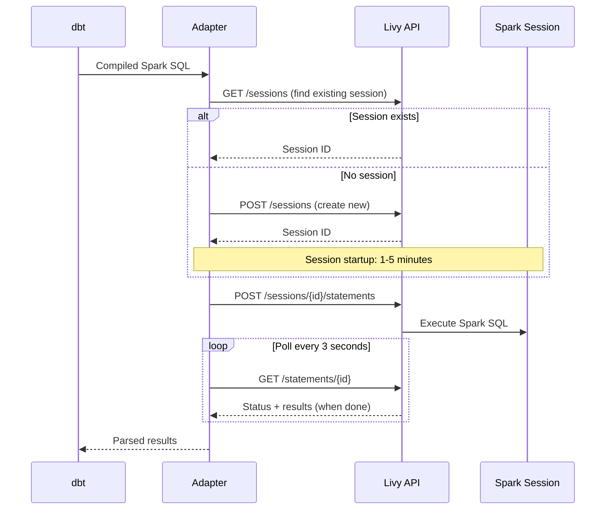

# Lakehouse (Spark SQL)

The dbt-fabric-samdebruyn adapter supports Fabric Lakehouse via the `fabricspark` adapter type. This uses **Spark SQL** as the query language and connects to Fabric through the [Livy API](https://learn.microsoft.com/fabric/data-engineering/lakehouse-api?WT.mc_id=MVP_310840) -- an HTTP REST interface for submitting Spark statements.

---

## Getting started

### Installation

Install the adapter with the `[spark]` extra:

```bash
pip install dbt-fabric-samdebruyn[spark] dbt-core
```

This installs [dbt-spark](https://github.com/dbt-labs/dbt-spark) as a dependency.

### Configuration

Add a FabricSpark profile to your `profiles.yml`:

```yaml
default:
  target: dev
  outputs:
    dev:
      type: fabricspark
      workspace: your workspace name
      database: name_of_your_lakehouse
      schema: dbt
```

The `workspace` (or `workspace_id`) is always required for FabricSpark -- the adapter uses it to resolve the Livy API endpoint. The `database` field is the name of your Lakehouse.

For all configuration options, see the [configuration reference](configuration.md).

### Authentication

The [authentication methods](authentication.md) documented in the authentication guide work with both adapter types. When following examples there, substitute `type: fabricspark` where the examples show `type: fabric`. Note that `ActiveDirectoryIntegrated` and `ActiveDirectoryPassword` are Data Warehouse-only methods and do not work with FabricSpark.

The FabricSpark adapter does not use the [`host`](configuration.md#host) option -- it always resolves the Livy endpoint from the workspace and lakehouse information.

---

## How it works

The FabricSpark adapter executes all SQL through Fabric Livy sessions. Here is the execution flow:



Key technical details:

- **Session reuse** -- All statements in a dbt run share the same Livy session (named `dbt-fabric-samdebruyn` by default). This avoids the overhead of creating a new Spark session for each model.
- **Session TTL** -- Sessions are created with a TTL of 30 seconds. If the session is idle for longer than that after the dbt run finishes, Fabric will automatically clean it up.
- **Polling interval** -- The adapter polls for statement completion every 3 seconds.
- **Rate limiting** -- The Fabric Livy API enforces rate limits. The adapter handles HTTP 429 responses automatically using the `Retry-After` header.
- **DB-API 2.0 cursor** -- Results are returned as JSON and parsed into a [PEP 249](https://peps.python.org/pep-0249/) compatible cursor, so dbt interacts with the Lakehouse the same way it interacts with any other database.

---

## Materializations

### Default materialization: `materialized_view`

Unlike most dbt adapters where the default materialization is `view` or `table`, the FabricSpark adapter defaults to **`materialized_view`**. This creates Fabric [lake views](https://learn.microsoft.com/fabric/data-engineering/lakehouse-sql-analytics-endpoint?WT.mc_id=MVP_310840), a Fabric-specific concept.

Lake views support:

- `CREATE OR REPLACE` semantics
- `PARTITIONED BY` clauses
- `TBLPROPERTIES` (Spark table properties)
- `CHECK` constraints with `ON MISMATCH` behavior

### Supported materializations

| Materialization | Supported | Notes |
| --- | --- | --- |
| `materialized_view` | Yes | Default. Creates a Fabric lake view. |
| `table` | Yes | Creates a managed Delta table. |
| `view` | No | Fabric Lakehouse with schemas does not support Spark SQL views. |
| `incremental` | Yes | Supports `append` and `insert_overwrite` strategies. `merge` and `delete+insert` are not supported. |
| `ephemeral` | Yes | Standard CTE-based ephemeral models. |

!!! warning "No Spark SQL views"

    Fabric Lakehouse with schemas enabled does not support Spark SQL views. If a model or package uses `materialized='view'`, you will see the error `'view' is not a valid FabricSparkRelationType`. Change the materialization to `materialized_view` or `table`.

---

## Identifier quoting

FabricSpark uses **backticks** (`` ` ``) for identifier quoting, following Spark SQL conventions. This is different from the Data Warehouse adapter, which uses T-SQL brackets (`[]`).

```sql
-- FabricSpark (Spark SQL)
SELECT `my column` FROM `my_schema`.`my_table`

-- Fabric Data Warehouse (T-SQL)
SELECT [my column] FROM [my_schema].[my_table]
```

---

## Performance considerations

The Livy API architecture has inherent performance characteristics that are important to understand.

### Session startup

Creating a new Spark session can take **1-5 minutes**. The adapter reuses sessions within a run, so this overhead is paid once per `dbt run`. Subsequent runs may reuse an existing session if it is still alive.

### Statement execution

Each SQL statement involves multiple HTTP API calls (submit + poll). This is inherently slower than a direct database connection like the TDS protocol used by the Data Warehouse adapter.

### Polling overhead

The adapter polls for statement completion every 3 seconds. Even very fast queries take at least 3 seconds to return.

### API rate limiting

Fabric applies rate limits to the Livy API. The adapter handles HTTP 429 responses automatically by respecting the `Retry-After` header. During heavy workloads, you may see pauses of 5-30 seconds between statements.

### Practical impact

A dbt run with many models will be significantly slower on FabricSpark than on Fabric Data Warehouse. This is inherent to the Livy API architecture, not a limitation of the adapter.

### Recommendations

- Use higher thread counts to parallelize model execution and amortize the per-statement overhead. However, higher parallelism also increases API call volume, which can trigger rate limiting sooner.
- Keep models as consolidated as possible to reduce the total number of statements.
- Monitor the Spark session in the [Fabric monitoring hub](https://learn.microsoft.com/fabric/data-engineering/spark-monitor-overview?WT.mc_id=MVP_310840) to understand execution patterns.

---

## Differences from Fabric Data Warehouse

| Concept | Data Warehouse (`fabric`) | Lakehouse (`fabricspark`) |
| --- | --- | --- |
| SQL dialect | T-SQL | Spark SQL |
| Connection | mssql-python (TDS protocol) | Livy sessions (HTTP REST) |
| Identifier quoting | `[brackets]` | `` `backticks` `` |
| Default materialization | `table` | `materialized_view` (lake view) |
| Views | Supported | Not supported |
| String type | `varchar(MAX)` | `string` |
| Timestamp type | `datetime2(6)` | `timestamp` |
| Pagination | `SELECT TOP N` | `LIMIT N` |
| Catalog queries | `sys.tables`, `sys.columns` | `SHOW TABLES`, `DESCRIBE` |
| Python models | Via Livy + separate lakehouse config | Native (same Livy session) |
| MERGE incremental | Supported | Not supported |
| [CLUSTER BY](cluster-by.md) | Supported | Not supported |
| [Warehouse snapshots](warehouse-snapshots.md) | Supported | Not supported |
| [Catalog statistics](catalog-stats.md) | Supported | Not supported |

---

## Python models

Python models work differently depending on the adapter type:

- **`type: fabric` (Data Warehouse):** Python models use Livy to execute PySpark code that reads from and writes to the Data Warehouse via the [synapsesql connector](https://learn.microsoft.com/fabric/data-engineering/spark-data-warehouse-connector?WT.mc_id=MVP_310840). You need both a [`lakehouse`](configuration.md#lakehouse) (for the Livy session) and a [`database`](configuration.md#database) (the DW target).
- **`type: fabricspark` (Lakehouse):** Python models run on the same Livy session that handles all SQL models. The [`database`](configuration.md#database) field IS the lakehouse. No separate `lakehouse` config is needed.

See the [Python models guide](python-models.md) for writing and debugging Python models.

---

## Limitations

- **No Spark SQL views** -- only tables and materialized lake views (Fabric lake views) are supported.
- **No incremental merge strategy** -- the Spark SQL `MERGE` syntax in Fabric Lakehouse is not supported by the adapter. Use `append` or `insert_overwrite` instead.
- **API rate limiting** -- can slow down large runs with many models.
- **Session startup time** -- 1-5 minutes for the first statement in a run.
- **Data Warehouse-only features** -- [CLUSTER BY](cluster-by.md), [warehouse snapshots](warehouse-snapshots.md), and [catalog statistics](catalog-stats.md) are not available for Lakehouse.

---

## Troubleshooting

| Symptom | Cause | Fix |
| --- | --- | --- |
| `Livy session did not become idle in time` | Session startup took too long | Increase [`spark_session_timeout`](configuration.md#spark_session_timeout), retry, or check Fabric capacity |
| `HTTP 429` in logs | API rate limiting | Automatic -- the adapter retries. Reduce `threads` if excessive. |
| `'view' is not a valid FabricSparkRelationType` | Model uses `view` materialization | Change to `materialized_view` or `table` |
| Slow execution | Livy polling overhead | Expected behavior. Use higher thread count. |
| Statement timeout | Long-running Spark query | Increase [`query_timeout`](configuration.md#query_timeout) |
| `Either workspace_id or workspace_name must be provided` | Missing workspace configuration | Add [`workspace`](configuration.md#workspace_name) or [`workspace_id`](configuration.md#workspace_id) to your profile |
